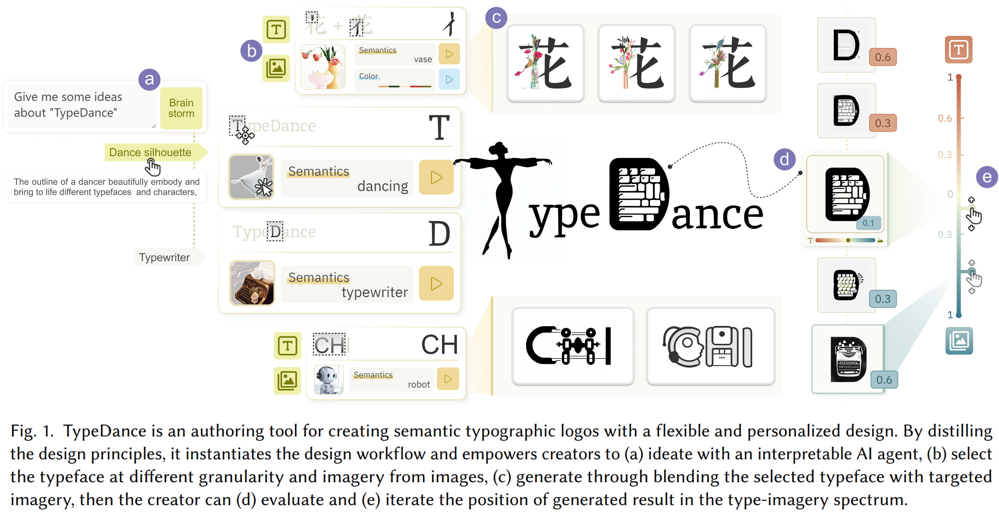
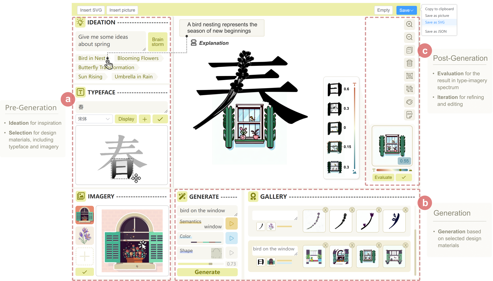
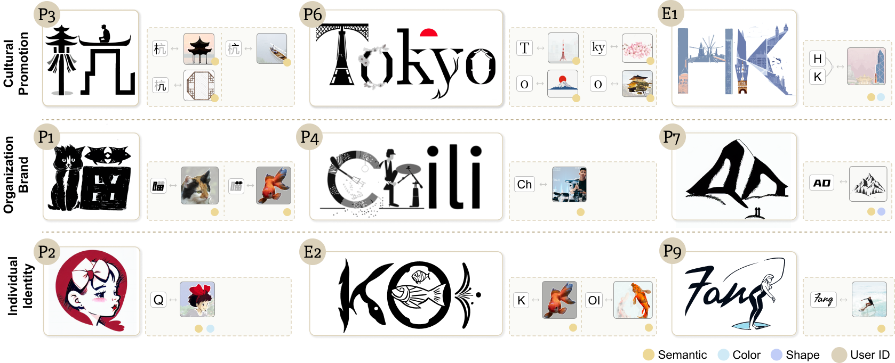

<h2 align="center">TypeDance: Creating Semantic Typographic Logos from Image throughPersonalized Generation</h2>

<div align="center"><i>CHI 2024</i></div>

<!-- <br> -->

<!--  -->

<br>

<p align="center">
  <a href="https://arxiv.org/abs/2401.11094">Paper</a> |
  <a href="https://github.com/SerendipitysX/TypeDance.git">Supplemental Video</a>
</p>

<p align="center">
  <a href="#license">License</a> |
  <a href="#citation">Citation</a> |
  <a href="#contact">Contact</a>
</p>

---


 

## **Dependencies and Installation**

```bash
git clone https://github.com/SerendipitysX/TypeDance.git
cd TypeDance
conda create --name <environment_name> --file requirements.txt
```

## Pretrained Model

In this work, we benefit from some excellent pretrained models, including [Segment Anything](https://github.com/facebookresearch/segment-anything) for user to point out specific visual representation in an image and [DIS](https://github.com/xuebinqin/DIS) for background removal. For generation, we use [Diffusers](https://github.com/huggingface/diffusers), and the model we choose is `runwayml/stable-diffusion-v1-5`.

To use these models, please follow the steps below:

1. Download the background removal model from [here](https://drive.google.com/file/d/1XHIzgTzY5BQHw140EDIgwIb53K659ENH/view).
2. Download the segment anything model from [here](https://dl.fbaipublicfiles.com/segment_anything/sam_vit_h_4b8939.pth)
3. Unzip the folder and save them to `models/`.

## Backend Setup

```bash
python TypeDance.py
```

## Frontend Setup

1. Go to `TypeDance/frontend` path

2. Install all the needed packages through npm

   ```
   npm install
   ```

3. Compiles and hot-reloads for development

   ```
   npm run dev
   ```


## Cases
By specifying the typeface and object in the image, users are allowed to combine them to generate a harmonious blend. See the figure below for details.


## **Contact**

We are glad to hear from you. If you have any questions, please feel free to contact [xrakexss@gmail.com](mailto:xrakexss@gmail.com) or open issues on this repository.

## **license**
This project is open sourced under GNU Affero General Public License v3.0.

## Citation
If this work helps your research or if you use any resources in this repository, please consider to cite:

```bibtex
@inproceedings{xiao2024typedance,
  title={TypeDance: Creating Semantic Typographic Logos from Image throughPersonalized Generation},
  author={Xiao, Shishi and Wang, Liangwei and Ma, Xiaojuan and Zeng, Wei},
  booktitle={Proceedings of the 2024 CHI Conference on Human Factors in Computing Systems},
  year={2024}
}
```